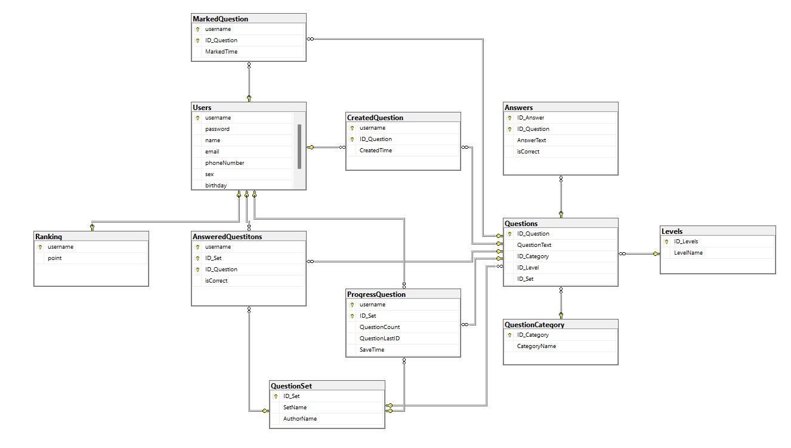

# QuizApp

## Giới thiệu
Một dự án xây dựng ứng dụng di động Android về trò chơi đố vui, nơi người dùng có thể thử thách kiến thức của mình qua các câu hỏi trắc nghiệm thuộc nhiều lĩnh vực khác nhau.

## Tính năng chính
-   **Giao diện thân thiện:** Thiết kế giao diện người dùng (UI) đơn giản, trực quan và dễ sử dụng.
-   **Chơi Quiz theo chủ đề:** Người dùng có thể lựa chọn các chủ đề câu hỏi khác nhau (ví dụ: Lịch sử, Khoa học, Thể thao,...).
-   **Tính điểm và xếp hạng:** Hệ thống tự động chấm điểm sau mỗi lượt chơi và hiển thị điểm số cao nhất.
-   **Câu hỏi đa dạng:** Ngân hàng câu hỏi phong phú được lấy từ API hoặc cơ sở dữ liệu cục bộ.
-  **Thỏa sức sáng tạo:** Người dùng có thể tự do đống góp bộ câu hỏi hay, thú vị cho app

## [UI - Figma](https://www.figma.com/design/XXSg4xNxQzLgofNDYZllwh/13.-Quiz-App?node-id=54-103&t=64G5P13PoBqI2SfU-1)

## Công nghệ sử dụng

### Mobile
-   **Ngôn ngữ:** **Java** - được sử dụng xuyên suốt để phát triển toàn bộ ứng dụng
-   **Kiến trúc:** Dự án áp dụng kiến trúc **MVVM (Model-View-ViewModel)** kết hợp với Repository Pattern:
    - **Models:** Các class dữ liệu như Answer trong thư mục DATA/Models
    - **Views:** Activities và Fragments được tổ chức theo chức năng
    - **ViewModels:** Logic xử lý UI được tách biệt trong thư mục DATA/ViewModels
    - **Repository:** Tầng trung gian để xử lý dữ liệu từ nhiều nguồn

-   **UI Components:**
    - **ViewPager:** Sử dụng cho phần tạo quiz và chơi quiz với các adapter tương ứng
    - **RecyclerView:** Áp dụng cho hiển thị danh sách (bookmarked, created, leaderboard)
    - **Fragments:** Tổ chức UI theo dạng module, dễ tái sử dụng và quản lý
    - **Custom Dialogs:** Nhiều popup dialogs được thiết kế riêng cho thông báo, kết quả

-   **Networking:**
    - **RESTful API:** Tương tác với backend thông qua Interface API
    - **Date/Time Handling:** Xử lý thời gian với DateTimeConverter

-   **Tính năng đặc biệt:**
    - **Daily Check-in System:** Hệ thống đăng nhập hàng ngày
    - **Daily Quizzes:** Câu đố hàng ngày để giữ người dùng tương tác
    - **Leaderboard:** Bảng xếp hạng người chơi
    - **Quiz Creation:** Cho phép người dùng tạo bộ câu hỏi riêng
    - **Bookmark System:** Lưu trữ câu hỏi yêu thích

-   **Giao diện người dùng (UI):**
    - UI được xây dựng bằng **XML Layouts** với nhiều custom drawables
    - Thiết kế responsive, thích ứng với nhiều kích thước màn hình
    - Navigation dựa trên fragments và activities

-   **Build System:** 
    - **Gradle:** Quản lý dependencies và build process

### API/Backend
-   **Công nghệ chính:**
    - **ASP.NET Core Web API (.NET 6.0)**: Framework hiện đại, cross-platform để xây dựng RESTful APIs
    - **Entity Framework Core**: ORM (Object-Relational Mapping) để tương tác với cơ sở dữ liệu
    - **C#**: Ngôn ngữ lập trình mạnh mẽ của Microsoft được sử dụng để phát triển API

-   **Kiến trúc API:**
    - **RESTful API**: Tuân theo các nguyên tắc REST với các endpoints được tổ chức theo tài nguyên
    - **Controller-based architecture**: Mỗi thực thể có controller riêng để xử lý các request
    - **Repository Pattern**: Tách biệt logic truy cập dữ liệu khỏi controllers
    - **Code-First Approach**: Sử dụng Migrations để quản lý schema cơ sở dữ liệu

-   **Các thành phần chính:**
    - **Controllers**: Xử lý các HTTP requests (15+ controllers bao gồm Questions, Answers, Users...)
    - **Models**: Đại diện cho các thực thể dữ liệu (13+ models)
    - **DbContext**: Quản lý kết nối đến database và các entity
    - **Migrations**: Quản lý phiên bản và cập nhật schema database

-   **Chức năng API:**
    - **Quản lý người dùng**: Đăng ký, đăng nhập, cập nhật thông tin
    - **Authentication**: Xác thực người dùng thông qua AuthController
    - **Quản lý câu hỏi**: CRUD operations cho questions, answers
    - **Phân loại**: Hỗ trợ phân loại câu hỏi theo categories
    - **Theo dõi tiến độ**: Lưu trữ câu hỏi đã trả lời và tiến trình học tập
    - **Bookmark system**: Cho phép người dùng đánh dấu câu hỏi yêu thích
    - **Ranking & Leaderboard**: Hệ thống xếp hạng người dùng

-   **Cơ sở dữ liệu:**
    - Sử dụng Entity Framework Core để tương tác với database
    - Mô hình quan hệ phức tạp giữa các entities: Users, Questions, Answers, Categories...
    - Code-First Migrations cho phép theo dõi thay đổi schema

-   **Bảo mật:**
    - Xác thực thông qua AuthController
    - Mã hóa mật khẩu người dùng
    - API endpoints được bảo vệ phù hợp


## Database



## Hướng dẫn cài đặt và chạy dự án

### Yêu cầu hệ thống
- **Backend:**
  - .NET 6.0 SDK hoặc mới hơn
  - Visual Studio 2022 hoặc Visual Studio Code
  - SQL Server (Local/Express) hoặc Azure SQL Database

- **Frontend (Android):**
  - Android Studio (phiên bản mới nhất)
  - JDK 11 hoặc mới hơn
  - Thiết bị Android thật hoặc máy ảo với API level 24+ (Android 7.0 Nougat trở lên)

### Bước 1: Cài đặt và chạy Backend
1. **Cài đặt SQL Server** (nếu chưa có):
   - Tải và cài đặt SQL Server Express 
   - Đảm bảo bạn đã tạo một tài khoản và ghi nhớ thông tin kết nối

2. **Mở dự án API:**
   - Mở file `API_QuizAppDB.sln` trong Visual Studio
   - Hoặc mở thư mục `api` trong Visual Studio Code

3. **Cấu hình kết nối cơ sở dữ liệu:**
   - Mở file `appsettings.json`
   - Tìm chuỗi kết nối "DefaultConnection" và cập nhật thông tin SQL Server của bạn:
   ```json
   "ConnectionStrings": {
     "DefaultConnection": "Server=YOUR_SERVER;Database=QuizAppDB;Trusted_Connection=True;MultipleActiveResultSets=true"
   }
   ```

4. **Chạy Migrations để tạo cơ sở dữ liệu:**
   - Mở Terminal/Package Manager Console trong Visual Studio
   - Thực thi lệnh: 
   ```
   dotnet ef database update
   ```
   hoặc
   ```
   Update-Database
   ```

5. **Khởi chạy API:**
   - Nhấn F5 hoặc chọn "Start Debugging" trong Visual Studio
   - Hoặc chạy lệnh `dotnet run` trong thư mục api
   - API sẽ chạy mặc định tại địa chỉ `https://localhost:5001` và `http://localhost:5000`

### Bước 2: Cài đặt và chạy ứng dụng Android
1. **Mở dự án trong Android Studio:**
   - Mở Android Studio
   - Chọn "Open an Existing Project"
   - Trỏ đến thư mục `mobile`

2. **Cấu hình API Endpoint:**
   - Tìm file cấu hình API trong dự án (có thể nằm trong `DATA/InterfaceAPI`)
   - Cập nhật URL base API thành địa chỉ máy chủ của bạn:
   ```java
   // Nếu chạy API trên cùng máy và kết nối qua USB
   String BASE_URL = "http://10.0.2.2:5000/api/";
   
   // Hoặc nếu API được host trên máy chủ khác
   String BASE_URL = "http://your-api-address/api/";
   ```

3. **Build và chạy ứng dụng:**
   - Kết nối thiết bị Android thật hoặc khởi động máy ảo
   - Nhấn nút "Run" (Shift+F10) trong Android Studio
   - Chọn thiết bị để cài đặt ứng dụng


    
# Team: TrioForce

-   **Trần Đình Quý**  - [GitHub Profile](https://github.com/dqez)
-   **Nguyễn Vũ Khanh** - [GitHub Profile](https://github.com/VuKhanhNguyen)
-   **Nguyễn Đình Đức** - [GitHub Profile](https://github.com/DinhDucNguyen)

